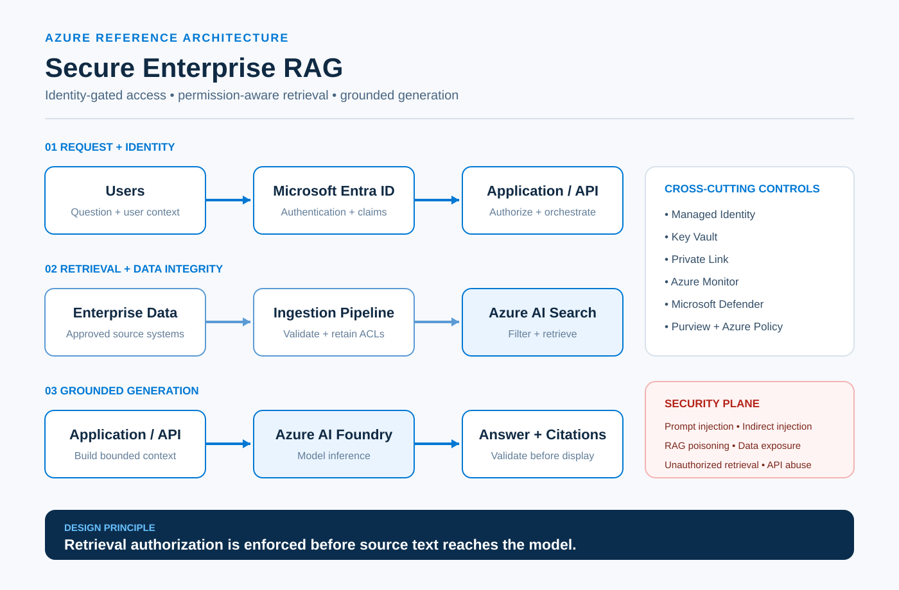

# Secure Enterprise RAG on Azure

> **Retrieval authorization is enforced before source text reaches the model.**

A practical reference architecture for building enterprise Retrieval-Augmented Generation (RAG) workloads on Microsoft Azure with identity-gated access, permission-aware retrieval, grounded generation, and defense-in-depth security controls.

This repository focuses on the part many RAG diagrams leave out: **where the system can fail and which controls belong in the architecture before production.**

## Architecture



[Architecture details](architecture/README.md) · [Threat model](docs/threat-model.md) · [Security controls](docs/security-controls.md) · [Validation checklist](docs/validation-checklist.md)

```text
Users
  ↓
Microsoft Entra ID
  ↓
Application / API
  ↓
Azure AI Search ← Ingestion Pipeline ← Enterprise Data Sources
  ↓
Application / API
  ↓
Azure AI Foundry / Azure OpenAI
  ↓
Validated Response + Citations
```

The application carries trusted user context through the retrieval workflow. Azure AI Search applies permission-aware retrieval so only content the requester is authorized to access can be returned for prompt assembly.

The model should never become the authorization boundary.

## Design Goals

- Authenticate users and establish trusted identity context.
- Preserve source permissions through ingestion and retrieval.
- Prevent unauthorized documents from entering model context.
- Ground responses in approved enterprise data.
- Protect sensitive information throughout the RAG lifecycle.
- Detect and reduce AI-specific abuse such as prompt injection and retrieval poisoning.
- Produce observable, auditable responses suitable for enterprise environments.

## Reference Flow

### 1. Request + Identity

**Users → Microsoft Entra ID → Application / API**

Microsoft Entra ID provides authentication and identity context such as users, groups, roles, device state, and Conditional Access signals. The application/API layer authorizes the request, applies guardrails, orchestrates the workflow, and passes the required user context into retrieval.

### 2. Retrieval + Data Integrity

**Enterprise Data Sources → Ingestion Pipeline → Azure AI Search**

Enterprise files, databases, SharePoint content, internal applications, and approved APIs are ingested with metadata and access-control information intact.

The ingestion path should:

- validate approved sources;
- chunk and enrich content;
- classify or label sensitive data where appropriate;
- preserve document-level ACLs and permission metadata;
- maintain provenance; and
- restrict who or what can modify indexed knowledge.

At query time, Azure AI Search combines retrieval with authorization filters so the application receives **only authorized chunks**.

### 3. Grounded Generation

**Application / API → Azure AI Foundry / Azure OpenAI → Response**

The application assembles a bounded prompt from authorized retrieval results, applies system instructions and safety controls, and sends the grounded context to the model.

Responses should include citations or source references where appropriate and be validated before display. Model access, output behavior, and anomalous usage should be monitored.

## Cross-Cutting Security Controls

| Control | Purpose |
|---|---|
| **Managed Identity** | Authenticate Azure workloads without embedding application secrets. |
| **Azure Key Vault** | Protect secrets, certificates, and cryptographic keys that remain necessary. |
| **Private Link** | Reduce public exposure by keeping supported service traffic on private endpoints. |
| **Microsoft Defender** | Strengthen workload security posture and surface relevant threats. |
| **Azure Monitor** | Centralize logs, metrics, alerting, and operational telemetry. |
| **Microsoft Purview** | Support data classification, governance, and data protection workflows. |
| **Azure Policy** | Enforce platform guardrails and configuration standards at scale. |

These controls should be designed as part of the workload—not added after the RAG pipeline is already deployed.

## Security Plane

A secure RAG implementation has to defend more than the model endpoint.

| Threat | Failure Path | Example Controls |
|---|---|---|
| **Prompt injection** | User input attempts to override system behavior or manipulate the application. | Input validation, prompt shields, content safety controls |
| **Indirect prompt injection** | Malicious instructions arrive inside retrieved documents or external content. | Treat retrieved content as untrusted, scan/isolate content, source allowlists, metadata filtering |
| **RAG poisoning** | Malicious or inaccurate data enters trusted retrieval sources. | Provenance, controlled ingestion, content validation, restricted writes, review for critical data |
| **Sensitive data exposure** | Retrieval or generation reveals data the user should not receive. | Classification, minimization, DLP, permission-aware retrieval |
| **Unauthorized retrieval** | Search returns documents outside the requester's permissions. | Document-level authorization, ACL enforcement, trusted user context in queries |
| **Model / API abuse** | Attackers misuse endpoints, consume resources, or attempt jailbreaks. | Strong identity, rate limits, quotas, monitoring, network controls |

## Core Security Principle

### Authorization before generation

A RAG application should not retrieve broadly and rely on the model to decide what a user is allowed to see.

Authorization belongs in the retrieval path.

```text
User identity
     ↓
Authorization context
     ↓
Permission-aware search
     ↓
Authorized chunks only
     ↓
Prompt assembly
     ↓
Model
```

This reduces the chance that restricted source text enters the model context in the first place.

## Implementation Guidance

When adapting this pattern to a real workload:

1. **Define the authorization model first.** Identify users, groups, application identities, document permissions, and the system of record for access decisions.
2. **Carry identity context end to end.** Do not lose authorization context between the application and retrieval layer.
3. **Preserve permissions during ingestion.** Content without trustworthy ACL or ownership metadata should not silently enter a permission-aware index.
4. **Treat retrieved data as untrusted input.** Enterprise documents can contain malicious, stale, or manipulated instructions.
5. **Separate control planes.** Restrict data ingestion, index administration, application execution, and model access using least privilege.
6. **Minimize network exposure.** Use private connectivity and controlled egress where the workload and service capabilities allow it.
7. **Instrument the complete path.** Monitor authentication, retrieval behavior, policy failures, model/API usage, and security events.
8. **Test authorization failures deliberately.** Validate that users cannot retrieve restricted documents through direct queries, semantic similarity, prompt manipulation, or alternate application paths.

## Validation Checklist

Before production, verify that:

- [ ] Users are strongly authenticated.
- [ ] Application and workload identities use least privilege.
- [ ] Document permissions survive ingestion.
- [ ] Retrieval filters are derived from trusted authorization context.
- [ ] Unauthorized chunks cannot reach prompt assembly.
- [ ] Retrieved content is handled as untrusted input.
- [ ] Ingestion sources and writers are controlled.
- [ ] Sensitive-data handling is defined and tested.
- [ ] Private connectivity is used where appropriate.
- [ ] Secrets and keys are centrally protected.
- [ ] Retrieval, model, and API activity is logged.
- [ ] Rate limits and abuse controls are configured.
- [ ] Prompt-injection scenarios have been tested.
- [ ] RAG-poisoning scenarios have been tested.
- [ ] Responses can be traced to their supporting sources.
- [ ] Security controls have been validated with negative tests—not only happy-path testing.

## Repository Contents

- [x] Reference architecture graphic and logical flow
- [x] RAG threat model
- [x] MITRE ATLAS candidate mappings
- [x] Azure security-control matrix
- [x] Production validation checklist
- [x] Secure retrieval examples
- [x] Sample authorization/security-filter implementation
- [x] Adversarial security test cases
- [ ] Deployment and configuration examples
- [ ] Evaluation harness and automated test execution

### Deep dives

- **[Architecture](architecture/README.md)** — trust boundaries, flow, and security layers.
- **[Threat Model](docs/threat-model.md)** — assets, abuse paths, MITRE ATLAS mappings, and adversarial test scenarios.
- **[Security Controls](docs/security-controls.md)** — identity, retrieval, networking, governance, telemetry, and Azure control mapping.
- **[Validation Checklist](docs/validation-checklist.md)** — negative authorization, prompt-injection, poisoning, leakage, network, and operational release tests.
- **[Examples](examples/README.md)** — ACL-aware schema, sample documents, trusted authorization filters, and adversarial test cases.

## Scope

This is a **reference architecture**, not a one-size-fits-all deployment template. Identity design, Azure service tiers, networking, regulatory requirements, data sensitivity, retrieval strategy, and authorization models should be adapted to the workload.

## Author

**Mario Worwell**  
Cloud Security Architect | Azure | AI Security | SIEM/XDR

Practical cloud-security architectures, detection engineering, governance patterns, and implementation guidance.
