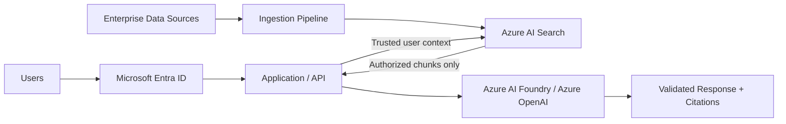

# Architecture

The Secure Enterprise RAG pattern separates **identity**, **authorization**, **retrieval**, **generation**, and **security controls** into explicit boundaries.

## Logical Flow

## Design Boundary

The model is **not** the authorization layer.

The application establishes trusted identity context and Azure AI Search enforces retrieval restrictions before content is assembled into the model prompt.

## Security Layers

- **Identity:** Microsoft Entra ID
- **Retrieval authorization:** document-level ACLs or security filters
- **Service authentication:** Managed Identity
- **Secrets:** Azure Key Vault
- **Network isolation:** Private Link / private endpoints
- **Governance:** Microsoft Purview and Azure Policy
- **Monitoring:** Azure Monitor and relevant Defender capabilities
- **AI-specific controls:** Prompt Shields, context isolation, abuse monitoring, output validation

See [Security Controls](../docs/security-controls.md), [Threat Model](../docs/threat-model.md), and [Validation Checklist](../docs/validation-checklist.md).
