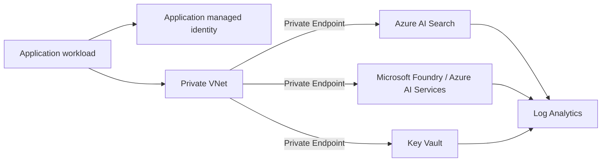

# Production-Hardening Deployment

This deployment is the security-focused counterpart to the low-cost lab in `deploy/main.bicep`.

It implements a **private, identity-first baseline** for the Secure Enterprise RAG architecture.

## Security posture

This template deploys:

- Azure AI Search with:
  - public network access disabled;
  - local/API-key authentication disabled;
  - system-assigned managed identity;
  - two replicas as a production-oriented availability baseline;
- Microsoft Foundry / Azure AI Services with public access disabled;
- Azure Key Vault with:
  - RBAC authorization;
  - purge protection;
  - public access disabled;
- a dedicated virtual network and private-endpoint subnet;
- Private Endpoints for Search, Foundry/Azure AI Services, and Key Vault;
- linked Private DNS zones;
- two explicit user-assigned managed identities:
  - **application identity** for query/model runtime;
  - **ingestion identity** for index writes;
- least-privilege role assignments;
- Log Analytics;
- diagnostic settings for Search, Foundry, and Key Vault.

## Identity separation

The template deliberately separates runtime and ingestion duties.

| Identity | Intended access |
|---|---|
| Application identity | Search Index Data Reader, Cognitive Services OpenAI User, Key Vault Secrets User |
| Ingestion identity | Search Index Data Contributor |

The application identity can retrieve authorized documents but cannot modify the index.

The ingestion identity can update indexed content but is not automatically granted model access.

That separation reduces the blast radius of a compromised runtime identity.

## Network flow



The template creates the network foundation but does not deploy application compute. Attach your chosen App Service, Container Apps environment, AKS, VM, or other application tier to a network path that can resolve and reach these private endpoints.

## Deploy

Create a resource group:

```bash
az group create \
  --name rg-secure-rag-prod \
  --location westus2
```

Validate:

```bash
az deployment group validate \
  --resource-group rg-secure-rag-prod \
  --template-file deploy/production/main.bicep \
  --parameters deploy/production/main.parameters.json
```

Preview:

```bash
az deployment group what-if \
  --resource-group rg-secure-rag-prod \
  --template-file deploy/production/main.bicep \
  --parameters deploy/production/main.parameters.json
```

Deploy:

```bash
az deployment group create \
  --name secure-rag-prod \
  --resource-group rg-secure-rag-prod \
  --template-file deploy/production/main.bicep \
  --parameters deploy/production/main.parameters.json
```

## Important production notes

### Private connectivity changes how you bootstrap

After public network access is disabled, index creation, document upload, and application queries must originate from a network path that can resolve and reach the Search private endpoint.

Do not work around this by temporarily opening the Search service to the internet as your standard deployment process.

Use a controlled deployment runner, self-hosted agent, administrative workstation connected through VPN/ExpressRoute, or workload inside the VNet.

### RBAC-only Search

The production template sets:

```text
disableLocalAuth = true
```

That means admin/query keys are not the intended authentication path.

Your runtime and ingestion code should use Microsoft Entra tokens through managed identity or another approved Entra principal.

### Model deployment remains explicit

This module creates the Foundry/Azure AI Services account but still does not select a model deployment.

Model choice, model version, quota, regional availability, capacity, and cost should remain a deliberate workload decision.

### Key Vault

The runtime identity receives **Key Vault Secrets User** as a baseline for workloads that still require application secrets.

Do not store authorization data or Search ACL decisions in Key Vault merely because a vault exists. Authorization should continue to come from trusted identity and source permission metadata.

### Diagnostics

The template routes supported logs and metrics to Log Analytics.

For a real environment, add:

- alert rules;
- workbooks/dashboards;
- retention aligned to policy;
- SIEM forwarding to Microsoft Sentinel where appropriate;
- incident-response ownership.

## What this template still does not solve

Production security still requires decisions outside infrastructure provisioning:

- source-specific ACL synchronization;
- document classification and lifecycle;
- application-layer authorization;
- prompt-injection defenses;
- RAG poisoning controls;
- secure prompt construction;
- safe rendering/output controls;
- model/content policy;
- cache/session isolation;
- evaluation and red-team testing;
- backup/recovery and regional resilience;
- regulatory controls specific to your environment.

Infrastructure is part of the security boundary, not the complete security program.

## Lab vs production

| Capability | Lab | Production baseline |
|---|---|---|
| Search tier | Free by default | Basic+ |
| Public network | Enabled | Disabled |
| Search API keys | Allowed | Disabled |
| Private Endpoints | No | Yes |
| Private DNS | No | Yes |
| Managed identities | Service identities | Service + workload identities |
| Role separation | Minimal | Runtime vs ingestion |
| Key Vault | No | Yes |
| Log Analytics | No | Yes |
| Diagnostic settings | No | Yes |
| Model deployment | Explicit/manual | Explicit/manual |

## Recommended next additions

This reference baseline can be extended with:

1. an application subnet and delegated compute service;
2. NAT/controlled egress;
3. Azure Firewall where inspection is required;
4. customer-managed keys where policy requires them;
5. Microsoft Sentinel analytics/incident integration;
6. Azure Policy assignments for private access, diagnostics, approved regions, and managed identity;
7. multi-region design where availability requirements justify the cost.
