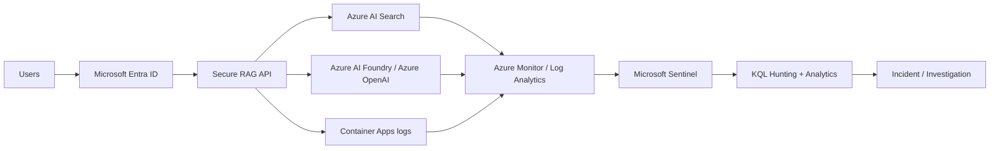

# Microsoft Sentinel + KQL Monitoring

This folder adds the **operational security layer** to the Secure Enterprise RAG architecture.

The goal is not to claim that Microsoft Sentinel can magically detect every prompt-injection or RAG attack from platform logs alone.

The goal is to combine:

1. **RAG application security telemetry**
2. **Azure AI Search diagnostics**
3. **Foundry / Azure OpenAI diagnostics**
4. **Container Apps platform telemetry**
5. **Microsoft Sentinel analytics and hunting**

into a practical detection and investigation workflow.

## Monitoring architecture



## Telemetry philosophy

Detection should happen at multiple layers.

| Layer | Security questions |
|---|---|
| Identity | Who is calling the RAG application? Are authentication/authorization failures increasing? |
| Application | Are users repeatedly receiving no authorized context? Are query rates abnormal? |
| Retrieval | Are Search operations spiking? Are administrative/index operations occurring unexpectedly? |
| Model | Are model calls or failures increasing unexpectedly? |
| Platform | Are Container Apps revisions, network paths, or identities changing? |
| SIEM | Can related events be correlated into one investigation timeline? |

## Application security events

The FastAPI application emits single-line JSON events to stdout through `app/telemetry.py`.

Azure Container Apps forwards console logs into Log Analytics when the production environment is connected to the workspace.

Current event types:

| Event type | Meaning |
|---|---|
| `rag_query_started` | Authenticated RAG query entered the application. |
| `rag_query_completed` | Search and generation completed. |
| `rag_no_authorized_context` | Caller was authenticated but retrieval returned no authorized documents. |
| `rag_authorization_denied` | Authentication/authorization boundary rejected the request. |
| `rag_request_failed` | Unhandled application request failure. |

### Privacy design

The application intentionally does **not** log:

- raw user prompts;
- retrieved document content;
- generated responses;
- access tokens;
- secrets.

User and tenant identifiers are pseudonymized before emission.

Document IDs can be logged to support investigations, but titles/content are not included.

## Log Analytics table

For Azure Container Apps console telemetry, queries in this repo assume:

```text
ContainerAppConsoleLogs_CL
```

and parse JSON from `Log_s`.

If your workspace uses a different schema/table, adapt the parsing function in the KQL files rather than rewriting the detections from scratch.

## Azure service diagnostics

The production Bicep baseline already routes supported diagnostics for:

- Azure AI Search;
- Microsoft Foundry / Azure AI Services;
- Key Vault;

to the Log Analytics workspace.

Depending on resource mode and diagnostic destination, Azure resource logs can appear in resource-specific tables or `AzureDiagnostics`.

The provided KQL therefore keeps service queries deliberately readable and easy to adapt to your workspace schema.

## KQL pack

### Hunting

- [RAG authorization-denial spike](hunting/rag-authorization-denial-spike.kql)
- [RAG no-authorized-context activity](hunting/rag-no-authorized-context.kql)
- [RAG query volume anomalies](hunting/rag-query-volume-anomaly.kql)
- [RAG source-access investigation](hunting/rag-source-access-investigation.kql)
- [Azure AI Search operation review](hunting/search-operation-review.kql)

### Detections

- [Repeated RAG authorization denials](detections/repeated-rag-authorization-denials.kql)
- [RAG request failure spike](detections/rag-request-failure-spike.kql)
- [Unusual RAG retrieval volume](detections/unusual-rag-retrieval-volume.kql)

## Recommended Sentinel implementation

1. Connect the Log Analytics workspace to Microsoft Sentinel.
2. Confirm Container Apps application logs are arriving.
3. Confirm Search and Foundry diagnostics are arriving.
4. Run each hunting query interactively.
5. Tune thresholds against normal workload behavior.
6. Promote stable queries into scheduled analytics rules.
7. Map entities only when the emitted data supports it safely.
8. Attach investigation queries/workbooks to the resulting incident process.

## Detection boundaries

Be precise about what a signal means.

For example:

- repeated `rag_authorization_denied` events can indicate probing, broken identity configuration, or a legitimate permission problem;
- `rag_no_authorized_context` can be normal for some questions;
- high request volume can be abuse, automation, or legitimate load;
- Search operation spikes do not prove data exfiltration.

Treat analytics rules as **investigation triggers**, not automatic proof of malicious intent.

## Bridge to Sentinel-KQL-Library

The reusable detections in this directory are intentionally suitable for mirroring into the broader `Sentinel-KQL-Library` repository.

Recommended ownership split:

- **Azure-Secure-Enterprise-RAG** — RAG telemetry schema, architecture-specific context, operational playbook, and canonical RAG detections.
- **Sentinel-KQL-Library** — reusable KQL detections/hunting queries that apply across environments.

This keeps the architecture repo focused while creating a clear portfolio connection to the detection-engineering repo.
